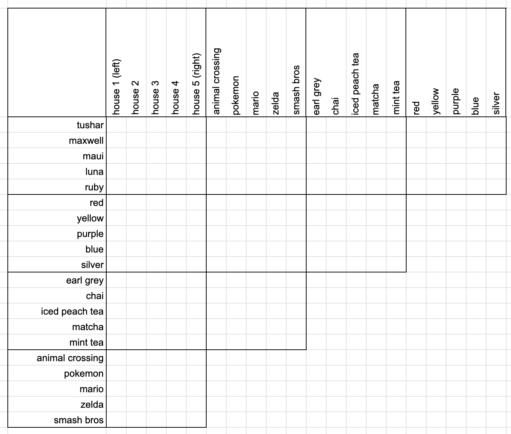

# Zebra Puzzles

_Today, in 2024, project is largely unmaintained. I'm using it as a playground for some things I want to try out, but I don't recommend anyone build off this._



Remember logic puzzles that looked like this? They had clues like:

- _There is one house between Tushar and Maui._
- _Ruby's favorite video game is Pokemon._
- _The chai drinker does not like the color blue._

I loved these as a kid, and watching Raymond Hettinger's [PyCon 2019 talk](https://www.youtube.com/watch?v=_GP9OpZPUYc) inspired me to revisit these problems. He showed us how to solve them; I wanted to learn how to generate them.

Using modern Python and constraint satisfaction (SAT) solvers, this project can be used to create random zebra puzzles.

## Structure

This project uses Python 3.12 and Poetry.

The entrypoint to this project is `src/main.py`; accordingly, run it with `[poetry run] python -m src.main`.
We use [questionary](https://github.com/tmbo/questionary/) to create a CLI with simple interactivity.

Other important files are:

- `puzzle.py` contains the main Puzzle class, which is mostly glue around clues and puzzle elements
- `clues.py` defines a clue (a higher-level statement that we can convert to a CNF) and several factories, like `found_at` or `same_house`; `generate.py` has utilities to create clues
- `elements.py` and `traptor_elements.py` have various puzzle elements

Finally, `sat_utils.py` contains the basic utilities for interacting with the SAT solver [pycosat](https://pypi.org/project/pycosat/). This code was almost entirely written by [Raymond Hettinger](https://rhettinger.github.io/einstein.html#essential-utilities-for-humanization) for his 2019 talk (thank you!).

## Example

```sh
❯ poetry run python -m src.main
? How large is the puzzle? (Use arrow keys)
 » 5
   4
   3
? Choose a Traptor type (Use arrow keys)
   🌴 Tropical
 » 🏰 Mythical
? 🥤 Should the puzzle include smoothies? (Use arrow keys)
 » Yes
   No
? 🔵 Should the puzzle include bottlecaps? (Use arrow keys)
 » Yes
   No

Clues
-----
# ... Some flavor text omitted ...

1. The Lesser Traptor and the Swamp Traptor are in the same house.
2. The Ancient Traptor is directly left of the Chocolate smoothie.
3. The Ancient Traptor and the Lemon smoothie are in the same house.
4. The Volcano Traptor is directly left of the Restless Traptor.
5. The Cave Traptor and Green bottlecaps are in the same house.
6. There are two houses between the Lake Traptor and the Snapper Traptor.
7. Green bottlecaps and the Fierce Traptor are in the same house.
8. There is one house between Black bottlecaps and the Coconut smoothie.
9. There is one house between the Lesser Traptor and the Kiwi smoothie.
10. The Dweller Traptor and the Chocolate smoothie are in the same house.
11. Red bottlecaps and the Dweller Traptor are in the same house.
12. Red bottlecaps is directly left of the Hoarder Traptor.
13. There are two houses between the Starfruit smoothie and Yellow bottlecaps.
14. The Lake Traptor and Black bottlecaps are in the same house.
15. The Stalker Traptor and the Fierce Traptor are in the same house.

                                                             Solution
┏━━━━━━┳━━━━━━━━━━━━━━━━━━━━━━━━┳━━━━━━━━━━━━━━━━━━━━━━━━━━┳━━━━━━━━━━━━━━━━━━━━━━━━━┳━━━━━━━━━━━━━━━━━━━━━━━━┳━━━━━━━━━━━━━━━━━━━┓
┃ Nest ┃ MythicalTraptorPrimary ┃ MythicalTraptorSecondary ┃ MythicalTraptorTertiary ┃        Smoothie        ┃     Bottlecap     ┃
┡━━━━━━╇━━━━━━━━━━━━━━━━━━━━━━━━╇━━━━━━━━━━━━━━━━━━━━━━━━━━╇━━━━━━━━━━━━━━━━━━━━━━━━━╇━━━━━━━━━━━━━━━━━━━━━━━━╇━━━━━━━━━━━━━━━━━━━┩
│    1 │   the Fierce Traptor   │     the Cave Traptor     │   the Stalker Traptor   │ the Starfruit smoothie │ Green bottlecaps  │
│    2 │  the Ancient Traptor   │     the Lake Traptor     │   the Crawler Traptor   │   the Lemon smoothie   │ Black bottlecaps  │
│    3 │   the Lesser Traptor   │    the Swamp Traptor     │   the Dweller Traptor   │ the Chocolate smoothie │  Red bottlecaps   │
│    4 │  the Greater Traptor   │   the Volcano Traptor    │   the Hoarder Traptor   │  the Coconut smoothie  │ Yellow bottlecaps │
│    5 │  the Restless Traptor  │   the Mountain Traptor   │   the Snapper Traptor   │   the Kiwi smoothie    │  Blue bottlecaps  │
└──────┴────────────────────────┴──────────────────────────┴─────────────────────────┴────────────────────────┴───────────────────┘
```

## Future work

In February 2024, what do I need to consider this "done"?

- Add HTML templating, because the site that I build these for requires that I include things like BR tags.
- Improve the grammar nits in the output, like capitalization in the flavor text.
- Add the header/footer resources that I copy/paste into the submission.

Maybe, someday, I will consider a web interface.
Could I lift the project using pyodide, or would the C-based pycosat cause problems?
What about another logic programming interface, like PySAT, answer set programming, or others from this [HN thread](https://news.ycombinator.com/item?id=36087464)?

These may happen. But the project is finally at a place that I'm happy with, and so I'm excited to share and write about it.

## Incomplete changelog

### 2024-02-18: improve outputs

2/18: make outputs simpler, less verbose, prettier. Update this README with new formatting and changes. Use the puzzle generator to create a new puzzle, finally!

2/17: update puzzle signature to accept the solution only, inferring the elements and element classes from it. Add a nicer display for the solution.

### 2023-11-25 & 2023-11-26: simplify

11/26: Clean up the puzzle/solution generation logic. Let the user choose the puzzle size.

11/25: Name some common types as type aliases (thanks, Python 3.12). Use logging instead of prints.

### 2023-11-19: continue tests

Add tests for clue types within `generate.py`.

Fix a bug that I introduced in `clues.py`. That file is so hard to understand, but it's also hard to write unit tests for; converting boolean expressions to CNF by hand is no fun.

Tune the weights of clues in the solution. Prepare to integrate the puzzle and solution classes.

Remove the checkbox-esque Smoothie selection, because it just gets in the way when trying to make puzzles quickly.

### 2023-11-13: continue tests and refactor

Continue adding tests. Finish up the unit tests for `sat_utils.py` and start a couple for `clues.py`, though that file is very hard to test because of the difficulty of hand-computing DNF-to-CNF conversions.

Next steps are unifying the puzzle and solution, creating a better `__repr__`, and simplifying how we represent puzzle size (attribute on `Puzzle`, tuple of ints 1 to N, just the number `n_houses`, etc.).

### 2023-11-12: updates to tools

Remove black and use ruff for formatting. Update dependencies. Add new CLI with simpler, clearer usage; `python -m src.main`.

### 2023-06-05: typing improvements

Rename `SATLiteral` -> `PuzzleElement` (smoothie, cat, etc.); this clarifies that it's not a Literal in the boolean sense and is instead a name for e.g., characters in a puzzle.

Create a new type `SATLiteral` (which is a `str` in a trenchcoat); this represents the literal in the boolean-variable sense, like "Value _el_ is at house _loc_" or "Value _el_ is not at house _loc_." Internally, these are represented by some integer _i_ and its negative counterpart _-i_.

Use (the new) `SATLiteral` as the return type of `comb(el: str, loc: int) -> SATLiteral`, mapping puzzle elements to literals, and `neg(el: SATLiteral) -> SATLiteral` to negate a literal.

Add `Clause: tuple[SATLiteral, ...]` representing a "∨" (boolean OR; disjunction) of literals; e.g., `(1, -5, 6)` is a disjunction stating that `x_1` is true, `x_5` is not true, or `x_6` is true.

Add `ClueCNF: list[Clause]`, representing a "∧" (boolean AND; conjunction) of `Clause`s. A puzzle in CNF is an "AND of ORs" ("∧ of ∨s" or "∧ of Clauses").

### 2023-06-03: improve printed display

Print the puzzle more clearly. Reduce verbosity of the clue reduction.

### 2023-06-01: random generation

Randomly generate the puzzle (with a seed) on each run.

### 2023-05-25: cleanup

Move examples into their own files. Update to Python 3.12 (beta). Add more lint rules. Clean up imports.

### 2023-04-25: rise from the dead

Add dev tools (black, ruff, pyright); run black & ruff in pre-commit. Update some types.

## Definitions

- "∧" is the boolean AND
- "∨" is the boolean OR
- a Clause is an "∨ of Literals"
- a CNF is an "∧ of Clauses," or equivalently an "∧ of ∨s" ("AND of ORs")

A DNF, in contrast, is a "∨ of ∧s." The DNF is the _answer_ to a SAT problem; a DNF of "A or B or C" reads that A, B, and C are all valid (satisfying) assignments. Converting a CNF to a DNF is therefore NP-hard, since from the DNF you can read off solutions to the CNF.

> CNF is an ∧ of ∨s, where ∨ is over variables or their negations (literals); an ∨ of literals is also called a clause. DNF is an ∨ of ∧s; an ∧ of literals is called a term.

### SAT

The core of this project is in expressing the zebra puzzle as a _Boolean satisfiability_ (SAT) problem ([Wikipedia](<(https://en.wikipedia.org/wiki/Boolean_satisfiability_problem)>).

The 3-SAT problem is known to be _NP-complete_.
That is, there is probably no polynomial-time algorithm to solve it.
This only describes the general case, though.

Our problem is small and well-specified (after all, we are creating these specifically for humans!).
This makes it an excellent fit for modern SAT solvers, and Hettinger's talk (and [notes](https://rhettinger.github.io/einstein.html)) demonstrates this beautifully.
